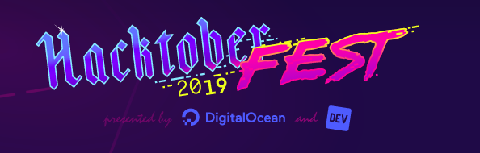
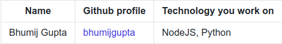

<h1 align="center">Hacktoberfest</h1>

     

       

## Register in Hacktoberfest 2019

-   Visit [Hacktoberfest 2019](https://hacktoberfest.digitalocean.com/profile) website 
-   Register using GitHub 
-   Open Pull Request between Oct 1 - Oct 31 🚀

## Creating a Pull Request

-   Fork this repo
-   Add your name, GitHub profile link and technology you work on, on [CONTRIBUTORS.md](./CONTRIBUTORS.md) 
    
-   Add any link/ resource to learn the technology in [Resources.md](./Resources.md) (optional)
-   Click on `New Pull Request`
-   Provide a title and description
-   Click `Create Pull Request` 🚀

## Important Links to work for Hacktoberfest

-   [24PullRequest](https://24pullrequests.com/projects)
-   [CodeTriage](https://www.codetriage.com/)
-   [Pull Request Roulette](http://www.pullrequestroulette.com)

## Want extra stickers?

Yasss!! 
Get free limited edition shark edition stickers by filling [DigitalOcean feedback](https://digitalocean.getfeedback.com/r/p44ADlqG/) form

## Code of Conduct

> Usage of foul language, addition of irrelevant links to `Resources.md` will lead to PR being tagged as `spam`

# Follow the awesomeness

Join Facebook Developer Circles: Vellore : [DevC Vellore](https://www.facebook.com/groups/DevCVellore/) 
Follow us on Twitter: [@FDCVellore](https://twitter.com/fdcvellore)
